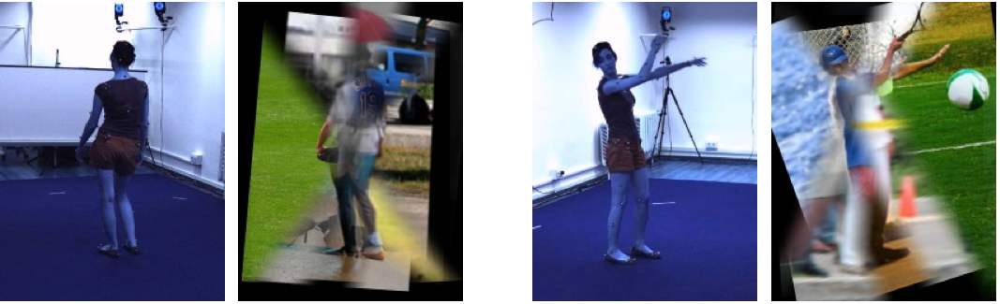
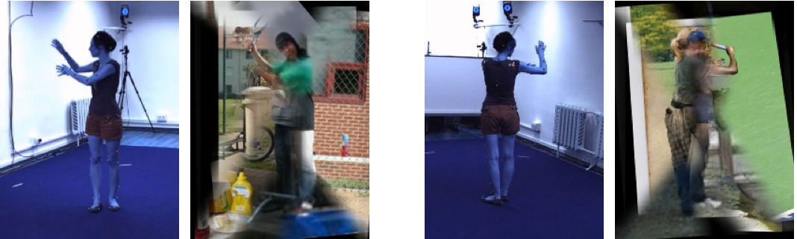
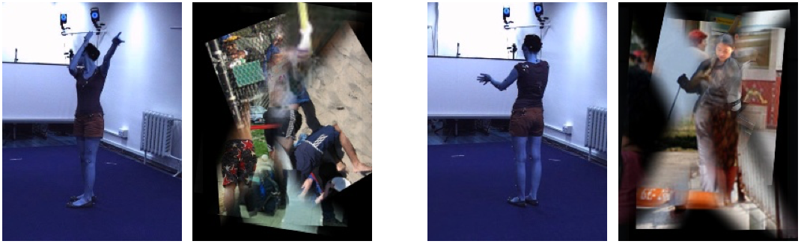

# Introductioon

Unofficial implementation of [MoCap-guided Data Augmentation for 3D Pose Estimation in the Wild (NeurIPS 2016)](https://proceedings.neurips.cc/paper/2016/hash/35464c848f410e55a13bb9d78e7fddd0-Abstract.html). 
Just for fun!
This repo does not provide the way to reproduce the paper. This repo utilizes the method to convert Human3.6M images to MSCOCO style. 

# How to run

Prepare Human3.6M and MSCOCO data. You can refer to [here](https://github.com/hongsukchoi/3DCrowdNet_RELEASE/blob/main/assets/directory.md).
Under `${ROOT}/tool/`, run `python mosaic.py --subject 1 --part 1`. `subject` is Human3.6M subject. `part` is the partition number. 
Change the output directory in line 50 of `mosaic.py` before running. 
You may improve the quality by commenting line 147,148 of `MSCOCO.py`.

# Results

## Good cases

## Awkward cases

## Bad cases

